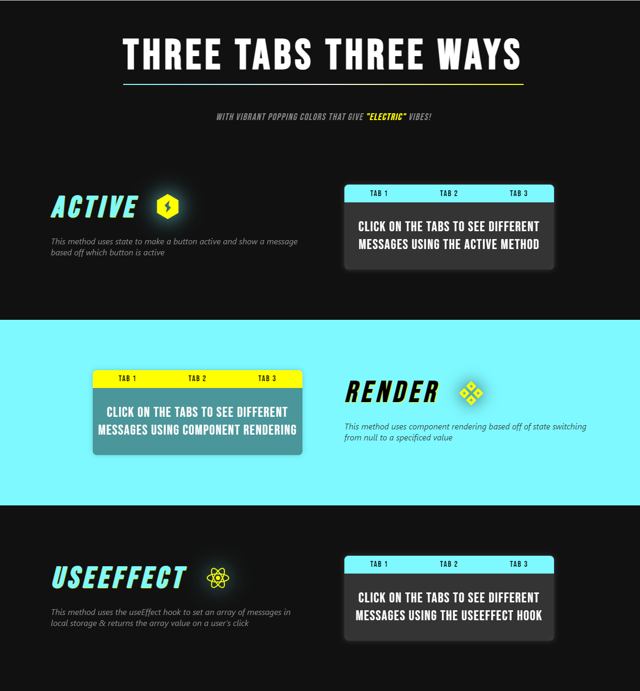

# Three Tabs Three Ways

## Table of Contents

- [Description](#description)
- [Features](#features)
- [Education](#education)

## Description

This app demonstrates some of the power and versatility of React js. It aims to demonstrate a few different ways that we as web devs can present data to users. 

- The first method here was using state to set a variable to 0. Then with an onClick function we set state variable to an index value (1, 2, or 3). Then we render messages from our "messages" array based off active-1. So if active === 1 we will render the 0th element in the array.

- The second method here was using functional component rendering. So first we create three separate functional components (messageOne.js, messageTwo.js, and messageThree.js). We import those at the top of our renderSection.js file to use later. We use state again to initialize the componentToShow variable to null and then onClick of a button, we will set the componentToShow variable to a string numeric value ("one", "two", "three"). Based off the current numeric string value of our state variable, we will render a whole functional component as our message.

- The third method here was using the useEffect hook. So first we store our messages array as a stringified value in local storage using the useEffect hook (this logic will happen after the component mounts). Then onClick, we will retrieve the key "messages" from local storage, parse the data into a workable object, and then display that data based off of the index of the button the user clicks"

## Features

## Education
